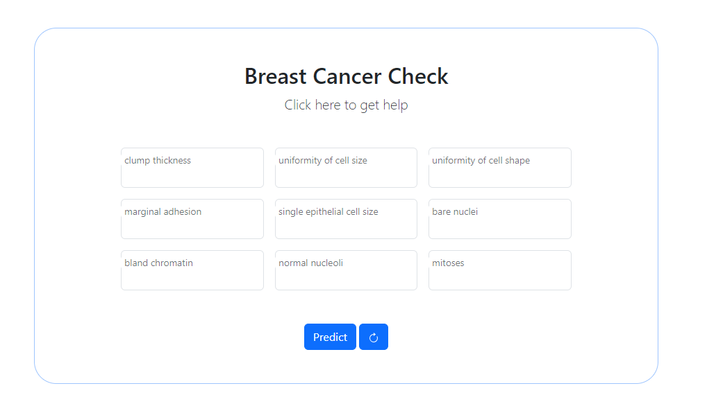

# Breast Cancer Project README

## Introduction

This README provides an overview of the Breast Cancer Project, an initiative aimed at raising awareness and providing resources related to breast cancer. The project includes a web interface that allows users to access information and support related to breast cancer.

## Project Overview

Breast cancer is a significant health concern affecting millions of people worldwide. The Breast Cancer Project is designed to provide vital information about breast cancer, including prevention, early detection, treatment options, and support resources. This project aims to empower individuals with knowledge to make informed decisions and connect those in need with the appropriate support.

## Features

The Breast Cancer Project includes the following  features:

1. **Sample Code Number**: This is a unique identifier assigned to each sample in the dataset. It serves as a reference to distinguish one data point from another.

2. **Clump Thickness**: Clump thickness is a feature that represents the thickness of the clumps of cells found in a breast cancer sample. It is typically measured on a scale from 1 to 10, with 1 indicating thin clumps and 10 indicating thick clumps.

3. **Uniformity of Cell Size**: Uniformity of cell size is a measure of how similar in size the individual cells are within a cell cluster. It is often scored on a scale from 1 to 10, with 1 indicating highly variable cell sizes and 10 indicating uniform cell sizes.

4. **Uniformity of Cell Shape**: Similar to uniformity of cell size, this feature measures the uniformity of the shape of the cells within a cluster. It is also scored on a scale from 1 to 10, with 1 indicating highly variable cell shapes and 10 indicating uniform cell shapes.

5. **Marginal Adhesion**: Marginal adhesion refers to the degree of adhesion or sticking together of the cancer cells at the outer edges (margins) of the cell cluster. It is often scored on a scale from 1 to 10, with 1 indicating weak adhesion and 10 indicating strong adhesion.

6. **Single Epithelial Cell Size**: This feature measures the size of individual epithelial cells within a cluster. It is typically assessed on a scale from 1 to 10, with 1 indicating small cell size and 10 indicating large cell size.

7. **Bare Nuclei**: Bare nuclei indicate the presence or absence of nuclei in the cells. It is usually recorded as a binary value, where 1 indicates the presence of nuclei and 0 indicates their absence.

8. **Bland Chromatin**: Bland chromatin refers to the appearance of the chromatin (material within the cell nucleus). It is often scored on a scale from 1 to 10, with 1 indicating bland or normal chromatin and 10 indicating highly irregular or abnormal chromatin.

9. **Normal Nucleoli**: Normal nucleoli are small structures within the cell nucleus. This feature assesses the appearance of these nucleoli and is scored on a scale from 1 to 10, with 1 indicating normal nucleoli and 10 indicating highly abnormal nucleoli.

10. **Mitoses**: Mitoses refer to the presence of mitotic figures or the process of cell division within the cell cluster. It is typically recorded as a count of the number of mitoses observed in a sample.

11. **Class**: The "Class" feature is the target variable, which indicates whether a given breast cancer sample is benign (non-cancerous) or malignant (cancerous). It is often encoded as 2 for benign and 4 for malignant.

These features are commonly used in breast cancer diagnosis and classification tasks to assess the characteristics of cell clusters and make predictions regarding the presence of cancer.

## Getting Started

To access the Breast Cancer Project web interface and start using the application:
[Link](x)

## Usage

The Breast Cancer Project interface is designed to be intuitive and user-friendly.

## Contributing

We welcome contributions from individuals who are passionate about spreading awareness and providing support for breast cancer. If you'd like to contribute to the project, please follow reach out: [Contribution Guidelines](mailto:oyekuabdulquadri123@email.com:) for detailed instructions.

Thank you for your interest in the Breast Cancer Project. Together, we can make a difference in the fight against breast cancer. If you have any questions or suggestions, please don't hesitate to [contact us](mailto:oyekuabdulquadri123@email.com:).

---

